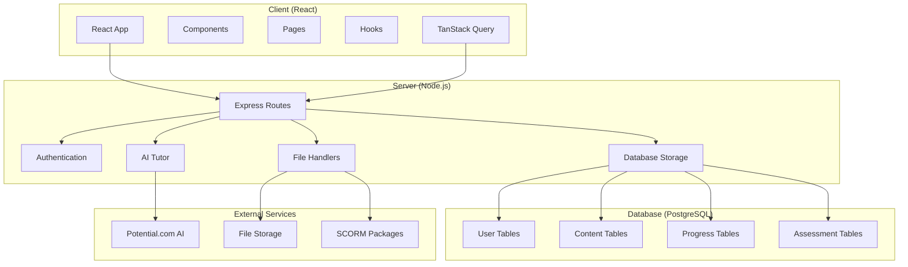
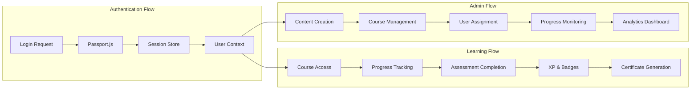
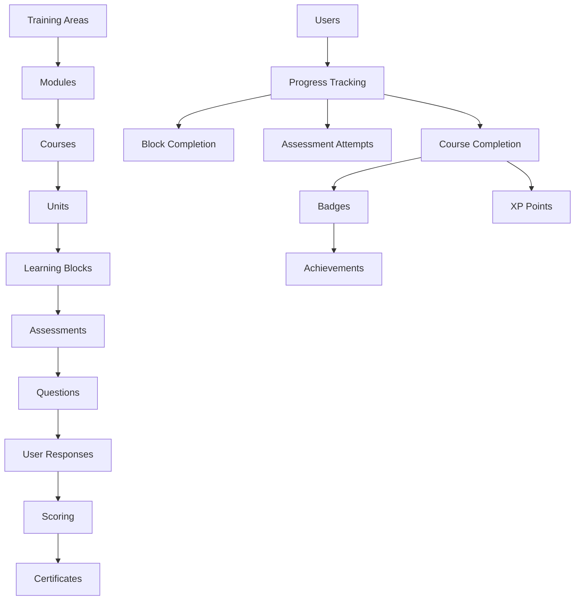

# VX Academy Project Breakdown

## Overview

The **VX Academy (Visitor Experience Academy)** is a comprehensive AI-powered training platform designed specifically for Abu Dhabi frontline professionals. It provides personalized learning experiences with robust content management, gamification, and assessment capabilities to train staff in visitor experience, hospitality, and cultural heritage.

### Key Features

- **Hierarchical Learning Structure**: Training Areas → Modules → Courses → Units → Learning Blocks → Assessments
- **Role-Based Access Control**: Admin, Sub-Admin, and User roles with different permissions
- **Gamification System**: XP points, badges, leaderboards, and certificates
- **Assessment Engine**: Comprehensive testing with multiple question types
- **SCORM Support**: Integration with SCORM packages for interactive learning
- **AI Integration**: Embedded AI tutor for personalized learning support
- **Multilingual Support**: English, Arabic, Urdu, and 6 other languages
- **Content Management**: Rich media support with images, videos, and documents

### Technology Stack

- **Frontend**: React 18 + TypeScript, Tailwind CSS, Shadcn UI
- **Backend**: Node.js + Express, TypeScript
- **Database**: PostgreSQL with Drizzle ORM
- **Authentication**: Passport.js with session-based auth
- **State Management**: TanStack Query for server state
- **Deployment**: Replit with Vite for development

---

## 📁 `/client` Directory

The frontend React application that provides the user interface for learners and administrators.

### 🏗️ Architecture & Structure

```
client/
├── index.html           # Main HTML template
├── src/
│   ├── main.tsx         # Application entry point
│   ├── App.tsx          # Root component with routing
│   ├── index.css        # Global styles with Tailwind
│   ├── components/      # Reusable UI components
│   ├── pages/           # Route-specific page components
│   ├── hooks/           # Custom React hooks
│   └── lib/             # Utility functions
└── public/              # Static assets
```

### 🔑 Key Files

#### **`src/main.tsx`**

- Application entry point
- Renders the root App component
- Minimal bootstrap code using React 18's createRoot

#### **`src/App.tsx`**

- Main application component
- Configures routing with Wouter
- Sets up global providers (QueryClient, Auth)
- Defines all application routes (public, protected, admin)

```typescript
// Route structure example
<Route path="/" component={HomePage} />
<Route path="/auth" component={AuthPage} />
<ProtectedRoute path="/dashboard" component={Dashboard} />
<ProtectedRoute path="/admin/users" component={UserManagement} />
```

#### **`src/index.css`**

- Global CSS with Tailwind directives
- Custom CSS variables for theming
- Typography and base styles
- Abu Dhabi brand colors and design system

#### **`index.html`**

- Main HTML template
- Loads Google Fonts (Poppins, Roboto, Tajawal for Arabic)
- Includes Potential.com AI chatbot script
- Responsive viewport configuration

### 🎨 Components Architecture

#### **Layout Components (`components/layout/`)**

- `header.tsx`: Top navigation bar with user profile
- `sidebar.tsx`: Navigation sidebar with menu items
- `mobile-nav.tsx`: Mobile bottom navigation
- `admin-layout.tsx`: Admin-specific layout with role-based navigation

#### **UI Components (`components/ui/`)**

- 50+ reusable components built with Radix UI
- Includes buttons, dialogs, forms, tables, etc.
- Follows Shadcn UI component patterns
- Fully accessible with keyboard navigation

#### **Feature Components**

- `dashboard/`: Welcome cards, progress tracking, achievements
- `assessment/`: Assessment flow, timer, comprehensive testing
- `course/`: Course cards, progress bars, detail views
- `admin/`: User management, content management, analytics

### 📄 Pages Structure

#### **Public Pages**

- `home-page.tsx`: Landing page with hero section and features
- `auth-page.tsx`: Login/registration with forms and validation

#### **Protected Pages**

- `dashboard.tsx`: Main learner dashboard with progress overview
- `courses.tsx`: Course catalog with filtering and search
- `enhanced-course-detail.tsx`: Detailed course view with units and blocks
- `achievements.tsx`: User achievements and badges
- `leaderboard.tsx`: Competitive rankings with filtering
- `ai-tutor.tsx`: AI assistant interface
- `profile.tsx`: User profile management

#### **Admin Pages (`pages/admin/`)**

- `dashboard.tsx`: Admin overview with statistics
- `user-management.tsx`: User CRUD operations
- `content-management.tsx`: Course content management
- `analytics.tsx`: Detailed analytics dashboard
- `roles-management.tsx`: Role-based access control
- Multiple specialized admin interfaces for different content types

### 🔧 Hooks & Utilities

#### **Custom Hooks (`hooks/`)**

- `use-auth.tsx`: Authentication state management
- `use-mobile.tsx`: Mobile device detection
- `use-block-assessment-progress.ts`: Learning progress tracking
- `use-toast.tsx`: Toast notification system

#### **Utilities (`lib/`)**

- `queryClient.ts`: TanStack Query configuration
- `utils.ts`: Common utility functions
- `protected-route.tsx`: Route protection wrapper

### 🎯 Key Features

#### **Authentication System**

- Session-based authentication
- Role-based route protection
- Automatic redirect handling
- Login/logout state management

#### **Learning Interface**

- Interactive course navigation
- Progress tracking visualization
- Assessment completion flow
- Badge and achievement display

#### **Admin Interface**

- Comprehensive content management
- User management with bulk operations
- Analytics dashboard with charts
- Role-based access controls

---

## 🖥️ `/server` Directory

The backend Express.js application that provides the API, authentication, and business logic.

### 🏗️ Architecture & Structure

```
server/
├── index.ts              # Server entry point
├── routes.ts             # API route definitions (3700+ lines)
├── auth.ts               # Authentication setup
├── db.ts                 # Database connection
├── database-storage.ts   # Database operations (1400+ lines)
├── storage.ts            # Storage interface definition
├── permissions.ts        # Role-based permissions
├── ai-tutor.ts           # AI tutor integration
├── certificate-*.ts     # Certificate generation
├── excel-upload-*.ts    # Excel bulk operations
├── image-handler.ts      # Image upload handling
├── media-handler.ts      # Media file management
├── scorm-handler.ts      # SCORM package processing
└── notification-*.ts    # Notification system
```

### 🔑 Key Files

#### **`index.ts`**

- Server entry point and bootstrap
- Express app configuration
- Request/response logging middleware
- Static file serving setup
- Port 5000 configuration for Replit

#### **`routes.ts`** (3,709 lines)

- **Massive central API router**
- Contains all API endpoints for the application
- Organized by feature areas:
  - Authentication routes
  - Course management
  - User management
  - Assessment handling
  - Admin operations
  - Analytics endpoints
  - Media upload/download

Key API endpoint categories:

```typescript
// Course Management
GET /api/courses
GET /api/courses/:id
POST /api/courses
PATCH /api/courses/:id

// User Management
GET /api/admin/users
POST /api/admin/users
DELETE /api/admin/users/:id

// Assessment System
GET /api/assessments
POST /api/assessments
GET /api/assessments/:id/attempts

// Progress Tracking
GET /api/progress
POST /api/progress
GET /api/user-progress/:userId
```

#### **`database-storage.ts`** (1,429 lines)

- **Core database operations class**
- Implements all CRUD operations
- Handles complex queries and joins
- Session store configuration
- Error handling and connection management

Key methods:

```typescript
// User Operations
createUser(user: InsertUser): Promise<User>
getUserByUsername(username: string): Promise<User>
updateUser(id: number, userData: Partial<User>): Promise<User>

// Course Operations
getCourses(): Promise<Course[]>
createCourse(course: InsertCourse): Promise<Course>
getUserProgressForAllCourses(userId: number): Promise<UserProgress[]>

// Assessment Operations
createAssessment(assessment: InsertAssessment): Promise<Assessment>
getAssessmentAttempts(userId: number, assessmentId: number): Promise<AssessmentAttempt[]>
```

#### **`auth.ts`**

- Passport.js authentication setup
- Login/logout route handlers
- Session management
- Password hashing with bcrypt
- Registration validation
- User session serialization

#### **`db.ts`**

- Database connection configuration
- Drizzle ORM setup
- Connection pool management
- Environment-specific configurations
- Neon PostgreSQL integration

#### **`permissions.ts`**

- Role-based access control system
- Permission definitions for each role
- Middleware for route protection
- User permission checking utilities

```typescript
// Permission definitions
const ROLE_PERMISSIONS = {
  admin: { canCreateUsers: true, canViewAnalytics: true, ... },
  "sub-admin": { canCreateUsers: true, canViewAnalytics: true, ... },
  user: { canCreateUsers: false, canViewAnalytics: false, ... }
}
```

### 🔧 Specialized Handlers

#### **`scorm-handler.ts`**

- SCORM package upload and extraction
- Manifest parsing (imsmanifest.xml)
- Content serving and tracking
- Progress data collection
- File system management

#### **`excel-upload-handler.ts`**

- Bulk user creation via Excel
- Data validation and parsing
- Error handling for malformed data
- Progress reporting during upload

#### **`certificate-pdf-service.ts`**

- Certificate generation from templates
- PDF creation and styling
- Dynamic content insertion
- Template management

#### **`ai-tutor.ts`**

- AI conversation handling
- Message processing and responses
- Context management
- Integration with external AI services

### 🛡️ Security & Middleware

#### **Authentication Middleware**

- Session validation
- Role-based access control
- Route protection
- User context injection

#### **File Upload Security**

- Multer configuration
- File type validation
- Size limitations
- Secure storage paths

#### **API Security**

- Request validation
- SQL injection prevention
- Session security
- CORS configuration

---

## 🔄 `/shared` Directory

Contains shared TypeScript types, schemas, and utilities used by both client and server.

### 🏗️ Architecture & Structure

```
shared/
├── schema.ts          # Database schemas and types (855 lines)
└── auth-utils.ts      # Authentication utilities
```

### 🔑 Key Files

#### **`schema.ts`** (855 lines)

- **Central data model definitions**
- Drizzle ORM table schemas
- TypeScript type exports
- Database relations
- Validation schemas with Zod

#### **Database Schema Overview**

```typescript
// Core Tables
- users: User profiles with comprehensive fields
- roles: Role definitions with permissions
- trainingAreas: Top-level content organization
- modules: Subject groupings
- courses: Individual learning programs
- units: Course subdivisions
- learningBlocks: Granular content units
- assessments: Evaluation components
- questions: Assessment questions
- userProgress: Learning progress tracking
- badges: Achievement system
- certificates: Completion certificates
- notifications: System messaging
- mediaFiles: File management
- scormPackages: SCORM content integration
```

#### **Key Schema Definitions**

**User Schema** - Comprehensive user profile:

```typescript
export const users = pgTable("users", {
  id: serial("id").primaryKey(),
  firstName: text("first_name").notNull(),
  lastName: text("last_name").notNull(),
  email: text("email").notNull().unique(),
  username: text("username").notNull().unique(),
  password: text("password").notNull(),
  role: text("role").notNull().default("user"), // admin, sub-admin, user
  createdBy: integer("created_by"), // Hierarchy tracking
  language: text("language").notNull().default("en"),
  nationality: text("nationality"),
  yearsOfExperience: text("years_of_experience"),
  assets: text("assets"), // Museum, Culture site, Events, etc.
  roleCategory: text("role_category"), // Transport staff, Welcome staff, etc.
  seniority: text("seniority"), // Manager, Staff
  xpPoints: integer("xp_points").notNull().default(0),
  // ... additional fields
});
```

**Content Hierarchy**:

```typescript
// Training Areas → Modules → Courses → Units → Learning Blocks → Assessments

export const trainingAreas = pgTable("training_areas", {
  id: serial("id").primaryKey(),
  name: text("name").notNull(),
  description: text("description"),
  imageUrl: text("image_url"),
});

export const courses = pgTable("courses", {
  id: serial("id").primaryKey(),
  trainingAreaId: integer("training_area_id").notNull(),
  moduleId: integer("module_id").notNull(),
  name: text("name").notNull(),
  description: text("description"),
  courseType: text("course_type").notNull().default("free"), // sequential, free
  duration: integer("duration").notNull(), // in minutes
  level: text("level").notNull().default("beginner"),
  // ... additional fields
});

export const learningBlocks = pgTable("learning_blocks", {
  id: serial("id").primaryKey(),
  unitId: integer("unit_id").notNull(),
  type: text("type").notNull(), // video, text, interactive, scorm, image
  title: text("title").notNull(),
  content: text("content"),
  videoUrl: text("video_url"),
  imageUrl: text("image_url"),
  interactiveData: json("interactive_data"),
  scormPackageId: integer("scorm_package_id"),
  xpPoints: integer("xp_points").notNull().default(10),
  // ... additional fields
});
```

**Assessment System**:

```typescript
export const assessments = pgTable("assessments", {
  id: serial("id").primaryKey(),
  unitId: integer("unit_id"),
  courseId: integer("course_id"),
  title: text("title").notNull(),
  placement: text("placement").notNull().default("end"), // beginning, end
  isGraded: boolean("is_graded").notNull().default(true),
  passingScore: integer("passing_score"),
  hasTimeLimit: boolean("has_time_limit").notNull().default(false),
  timeLimit: integer("time_limit"), // in minutes
  maxRetakes: integer("max_retakes").notNull().default(3),
  hasCertificate: boolean("has_certificate").notNull().default(false),
  xpPoints: integer("xp_points").notNull().default(50),
});

export const questions = pgTable("questions", {
  id: serial("id").primaryKey(),
  assessmentId: integer("assessment_id").notNull(),
  questionText: text("question_text").notNull(),
  questionType: text("question_type").notNull().default("mcq"), // mcq, open_ended, video
  options: json("options"), // For MCQs
  correctAnswer: text("correct_answer"),
  order: integer("order").notNull(),
});
```

#### **Type Exports**

All database schemas are exported as TypeScript types:

```typescript
export type User = typeof users.$inferSelect;
export type InsertUser = typeof users.$inferInsert;
export type Course = typeof courses.$inferSelect;
export type Assessment = typeof assessments.$inferSelect;
// ... and many more
```

#### **`auth-utils.ts`**

- Password hashing utilities
- Authentication helper functions
- Shared validation logic
- Security utilities

### 🔗 Relations & Constraints

The schema defines complex relationships:

- **User Hierarchy**: Admin → Sub-Admin → User
- **Content Hierarchy**: Training Areas → Modules → Courses → Units → Learning Blocks
- **Progress Tracking**: User progress across all content levels
- **Assessment Flow**: Questions → Attempts → Scores → Certificates
- **Gamification**: XP points, badges, achievements

---

## 🛠️ `/scripts` Directory

Contains utility scripts for database operations and development tasks.

### 🏗️ Architecture & Structure

```
scripts/
└── seed.ts           # Database seeding script (251 lines)
```

### 🔑 Key Files

#### **`seed.ts`** (251 lines)

- **Database initialization script**
- Creates initial data for development
- Handles multiple database connection types
- Includes sample users, courses, and content

#### **Key Functions**

**Database Connection Management**:

```typescript
async function createSeedConnection() {
  // Handles both local PostgreSQL and Neon serverless
  // Configures connection pools
  // Tests connections before proceeding
}
```

**Sample Data Creation**:

- Admin user accounts
- Training areas and modules
- Sample courses and units
- Initial learning blocks
- Demo assessments and questions
- Badge configurations
- Role definitions

#### **Database Environment Handling**

- **Local Development**: Uses traditional PostgreSQL driver
- **Production/Cloud**: Uses Neon serverless
- **Fallback**: Imports server database connection
- **Error Handling**: Comprehensive error management

#### **Usage**

```bash
npm run db:seed
```

### 🎯 Seeding Strategy

1. **Connection Validation**: Tests database connectivity
2. **Data Cleanup**: Optionally clears existing data
3. **User Creation**: Creates admin and sample users
4. **Content Structure**: Builds content hierarchy
5. **Relationships**: Establishes proper data relationships
6. **Validation**: Verifies data integrity

---

## 🏛️ System Architecture

### Overall Architecture Diagram



### Data Flow Architecture



### Content Hierarchy



---

## 🎯 Key Workflows

### 1. User Learning Journey

1. **Authentication**: Login via Passport.js
2. **Course Discovery**: Browse available courses
3. **Content Consumption**: Progress through learning blocks
4. **Assessment**: Complete quizzes and tests
5. **Progress Tracking**: Monitor completion status
6. **Achievement**: Earn badges and certificates

### 2. Admin Content Management

1. **Content Creation**: Build training areas and modules
2. **Course Development**: Create courses with units and blocks
3. **Assessment Design**: Build quizzes and evaluations
4. **User Management**: Create and manage user accounts
5. **Progress Monitoring**: Track learner progress
6. **Analytics**: Generate reports and insights

### 3. Assessment Flow

1. **Question Creation**: Build question banks
2. **Assessment Configuration**: Set time limits and scoring
3. **User Attempts**: Track attempt history
4. **Scoring**: Calculate results and provide feedback
5. **Certification**: Generate completion certificates
6. **Badges**: Award achievements based on performance

---

## 🔧 Development Setup

### Prerequisites

- Node.js 18+
- PostgreSQL database
- Environment variables configured

### Installation

```bash
# Install dependencies
npm install

# Setup database
npm run db:push
npm run db:seed

# Start development server
npm run dev
```

### Environment Variables

- `DATABASE_URL`: PostgreSQL connection string
- `SESSION_SECRET`: Session encryption key
- Additional configuration for external services

### Development Commands

- `npm run dev`: Start development server
- `npm run build`: Build for production
- `npm run db:push`: Push database schema
- `npm run db:seed`: Seed database with sample data

---

## 🎨 UI/UX Design

### Design System

- **Color Palette**: Abu Dhabi brand colors (teal, cyan, charcoal)
- **Typography**: Poppins, Roboto, Tajawal (Arabic support)
- **Components**: Shadcn UI with Radix primitives
- **Responsive**: Mobile-first design with breakpoints
- **Accessibility**: WCAG compliance

### Key Features

- **Glassmorphism**: Modern glass-like UI effects
- **Animations**: Smooth transitions and micro-interactions
- **Dark Mode**: Support for theme switching
- **RTL Support**: Right-to-left layout for Arabic
- **Mobile Navigation**: Bottom navigation for mobile users

---

## 📊 Analytics & Reporting

### Admin Analytics

- **User Activity**: Registration, login, and engagement metrics
- **Course Performance**: Completion rates and popular content
- **Assessment Results**: Scoring analysis and improvement areas
- **Progress Tracking**: Individual and aggregate progress data
- **Export Functionality**: Data export for external analysis

### Real-time Dashboards

- **User Statistics**: Active users, new registrations
- **Content Metrics**: Course enrollments, completion rates
- **Assessment Analytics**: Pass/fail rates, average scores
- **Engagement Metrics**: Time spent, activity patterns

---

## 🔐 Security & Compliance

### Authentication Security

- Session-based authentication
- Password hashing with bcrypt
- Role-based access control
- Session timeout handling

### Data Protection

- SQL injection prevention
- File upload validation
- Secure file storage
- User data encryption

### Compliance

- GDPR compliance considerations
- UAE data protection guidelines
- Audit logging for admin actions
- User consent management

---

## 🚀 Deployment

### Current Setup

- **Platform**: Replit hosting
- **Database**: Neon PostgreSQL
- **Port**: 5000 (single port for API and client)
- **Build**: Vite for frontend, esbuild for backend

### Production Considerations

- **Scaling**: Database connection pooling
- **Monitoring**: Error tracking and performance metrics
- **Backup**: Database backup strategies
- **CDN**: Static asset delivery optimization

---

This comprehensive breakdown provides a complete understanding of the VX Academy project structure, its components, and how they work together to create a robust training platform for Abu Dhabi's hospitality and tourism professionals.
